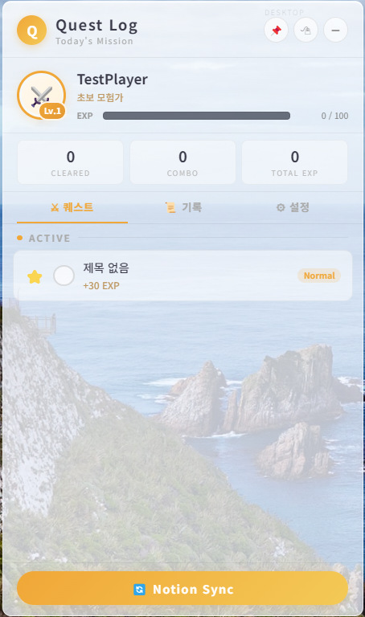
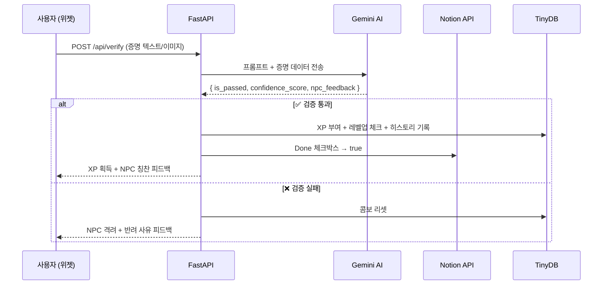

[](docs/README_EN.md) [](README.md)

# Quest Widget ⚔️

바탕화면에 상주하는 게이미피케이션 할 일 관리 위젯입니다.
노션(Notion) 데이터베이스와 실시간으로 동기화하며, Gemini AI가 '작업 증명(Proof of Work)'을 분석하고 검증하여 현실의 생산성을 게임처럼 관리합니다.

> **SAO(Sword Art Online) Utilities 스타일 UI** - 프로스티드 글래스 패널 + 오렌지 액센트 적용

## 💡 Motivation & Value

**"왜 단순한 투두(To-Do) 리스트가 아닌, AI NPC가 검증하는 게임화(Gamification) 위젯을 만들었을까?"**

### The Problem

- 기존의 생산성 앱이나 노션(Notion) 체크리스트는 단순히 체크박스를 채우는 데 그쳐, 알고리즘 문제 풀이나 개발, 연구 같은 장기적인 목표를 유지하기 위한 지속적인 동기부여(도파민)를 주지 못했습니다.
- 스스로 작업 증명(Proof of Work)을 남기더라도 이를 객관적으로 평가해 줄 시스템이 없어 루틴이 쉽게 무너지는 한계가 있었습니다.

### The Solution & Impact

- **LLM의 결정론적 활용:** 생성형 AI(Gemini)를 단순한 챗봇이 아닌, **구조화된 출력(Structured Outputs)**을 강제하여 사용자의 행동 데이터를 평가하는 '결정론적 검증 파이프라인'으로 활용했습니다.
- **일상의 RPG화:** 작업을 완료하고 코드를 제출하면 시스템이 이를 분석하여 경험치(XP)와 칭호를 부여합니다. 이는 지루한 일상을 끝없는 레벨업이 가능한 인디 게임처럼 바꾸어, 사용자에게 강력하고 즉각적인 성취감을 제공합니다.
- **MSA 기반의 확장성:** 무거운 프레임워크 대신 프레임리스 위젯(Electron/Tauri)과 FastAPI 백엔드를 완벽히 분리하여 데스크톱 리소스 점유율을 최소화하고, 추후 자체 학습한 모델(GNN-LLM)로 검증관을 교체할 수 있는 유연한 아키텍처를 설계했습니다.

## 📸 Screenshot

<!-- 위젯 스크린샷을 docs/ 폴더에 넣고 경로를 수정하세요 -->


## ✨ Features

- **노션 연동 (SSOT)** - 노션을 단일 진실 공급원(SSOT)으로 사용하여 퀘스트(할 일) 자동 동기화
- **AI 검증 파이프라인** - Gemini AI가 NPC 길드마스터가 되어 코드 스니펫이나 이미지를 다면 평가
- **데스크톱 네이티브 제어** - 바탕화면 고정, 클릭 무시(Click-through), 전역 단축키, 시스템 트레이 지원
- **게이미피케이션 엔진** - 레벨 커브 적용, XP 계산, 연속 콤보 트래킹 및 레벨업 이펙트

## 🏗 Architecture

Electron 기반의 경량화된 프론트엔드와 무거운 로직/AI 통신을 전담하는 FastAPI 백엔드를 분리한 MSA(Microservices Architecture) 형태를 취하고 있습니다.

```text
Quest Widget
├── Electron (Frontend)
│   ├── main.js          # 윈도우/트레이 생명주기 관리 및 FastAPI 서브 프로세스 실행
│   ├── preload.js       # contextBridge를 통한 안전한 IPC 통신
│   └── index.html       # Vanilla JS 기반의 SAO 스타일 UI 렌더링
│
└── FastAPI (Backend)
    ├── app/
    │   ├── main.py              # FastAPI 진입점 (CORS 및 라우터 설정)
    │   ├── models/schemas.py    # Pydantic 기반의 엄격한 DTO 및 타입 검증
    │   ├── routers/             # 노션 동기화, AI 검증, 유저 상태 API 라우터
    │   ├── services/            # 비즈니스 로직 (Notion API, Gemini API, TinyDB)
    │   └── prompts/
    │       └── verify_prompt.json # AI 프롬프트 템플릿 (코드 수정 없이 외부 관리)
    ├── data/database.json       # TinyDB 로컬 저장소 (유저 레벨 및 히스토리)
    └── backend.spec             # PyInstaller 빌드 설정 파일
```

## 🚀 Setup & Run

### 1. 노션 데이터베이스 세팅

노션에 데이터베이스를 생성하고 아래 프로퍼티를 정확히 추가합니다:

| Property | Type | 값 예시 |
|----------|------|---------|
| Name | Title | 알고리즘 문제 풀기 |
| Category | Select | `dev` / `study` / `life` / `work` / `etc` |
| Difficuity | Select | `easy` / `medium` / `hard` / `legendary` |
| Done | Checkbox | ✅ |
| Date | Date | 2024-01-01 |

> ⚠️ **Note**: `Difficuity`는 코드베이스와 매핑되는 실제 프로퍼티 이름이므로 오타 그대로 입력해야 합니다.

### 2. 환경 변수 설정 (.env)

루트 디렉토리의 `backend` 폴더 내에 `.env` 파일을 생성하고 발급받은 API 키를 입력합니다.

```env
NOTION_API_KEY=your_notion_api_key
NOTION_DATABASE_ID=your_database_id
GEMINI_API_KEY=your_gemini_api_key
HOST=127.0.0.1
PORT=8000
```

### 3. 설치 및 개발 모드 실행

Node.js 의존성을 설치하고 Python 가상환경을 구성합니다.

> `main.js`가 해당 이름의 가상환경 경로를 참조하므로 가상환경 이름은 반드시 **`daily-dungeon`**으로 생성해야 합니다.

```bash
# 1. Node 의존성 설치
npm install

# 2. Python 가상환경 생성 및 세팅 (Windows 기준)
python -m venv daily-dungeon
daily-dungeon\Scripts\activate
pip install -r backend/requirements.txt

# 3. 앱 실행 (Electron과 FastAPI가 동시 실행됨)
npm start
```

## 📦 Build

이 프로젝트는 PyInstaller를 이용해 파이썬 백엔드를 단일 실행 파일(.exe)로 묶고, 이를 Electron-builder가 최종 배포판으로 패키징합니다. (프롬프트 JSON 및 .env 파일은 빌드 시 자동 포함됩니다).

```bash
# 원클릭 빌드 (Windows)
build.bat
```

빌드가 완료되면 `release/` 폴더에 설치용 파일이 생성됩니다.

## ⌨️ Keyboard Shortcuts

| 단축키 | 기능 |
|--------|------|
| `Ctrl+Shift+Space` | 위젯 표시 / 숨기기 (전역) |
| `Ctrl+Shift+T` | 클릭 무시(Click-through) 모드 토글 (전역) |

## 🧙‍♂️ AI Verification System

사용자가 퀘스트 완료 후 증명(코드 스니펫, 텍스트 요약, 캡처 이미지 등)을 제출하면, Gemini AI가 설정된 JSON 스키마와 프롬프트에 따라 이를 다면 평가합니다.



- **통과 시**: 퀘스트 난이도에 따른 XP 획득, 노션 원본 데이터베이스 상태 변경(Done), NPC 칭찬 피드백.
- **실패 시**: 연속 달성 콤보 리셋, 구체적인 반려 사유 및 격려 피드백.

## 📈 Leveling Curve

레벨업 요구 경험치는 다음 수식에 따라 기하급수적으로 증가합니다: $Next\_XP = floor(Current\_XP \times 1.4)$

| 레벨 | 칭호 | 퀘스트 난이도 | 획득 XP |
|------|------|-------------|---------|
| 1 | 초보 모험가 | Easy | 15 |
| 3 | 수련생 | Normal | 30 |
| 5 | 전사 | Hard | 50 |
| 8 | 정예 기사 | Epic | 100 |
| 12 | 챔피언 | | |
| 20 | 전설 | | |

## 🛠 Tech Stack

- **Frontend**: Electron, HTML/CSS/Vanilla JS, Web Audio API
- **Backend**: FastAPI, Pydantic, httpx, TinyDB
- **AI & APIs**: Google Gemini API (@google/genai), Notion API
- **Build Tools**: PyInstaller, electron-builder
