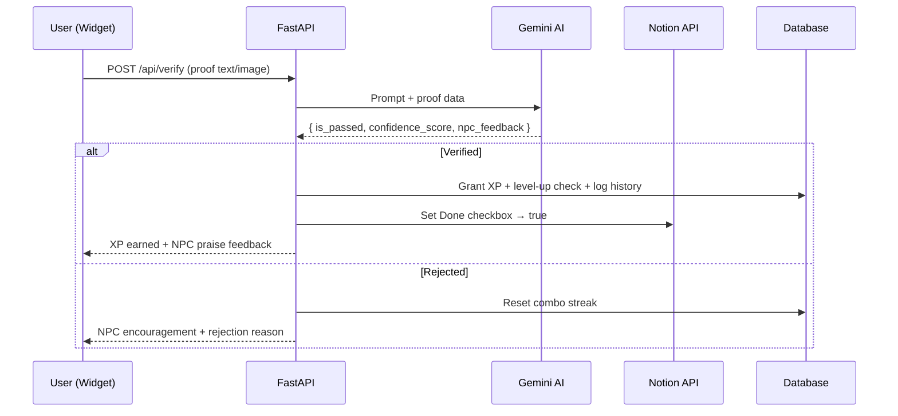

[](docs/README_EN.md) [](../README.md)

# Quest Widget

A gamification productivity widget that lives on your desktop.
Syncs with your Notion database in real-time, while a Gemini AI "Guild Master" NPC analyzes and verifies your Proof of Work — turning everyday tasks into an RPG adventure.

> **SAO (Sword Art Online) Utilities-style UI** — Frosted glass panels with orange accents

## Motivation & Value

**"Why build an AI-verified gamification widget instead of just another to-do list?"**

### The Problem

- Conventional productivity apps and Notion checklists only let you tick boxes — they fail to provide the sustained dopamine loop needed for long-term goals like algorithm practice, development, or research.
- Even when users leave Proof of Work (code commits, study notes), there is no objective system to evaluate it, causing routines to collapse quickly.

### The Solution & Impact

- **Deterministic use of LLMs:** Instead of a chatbot, Gemini AI is used as a *deterministic verification pipeline* with Structured Outputs that evaluates user behavior data against predefined criteria.
- **Real-life RPG:** Submit your work, and the system analyzes it to award XP and titles — transforming mundane tasks into an indie game with endless level-ups, delivering instant gratification.
- **MSA-based extensibility:** A frameless Electron widget and a FastAPI backend are fully decoupled, minimizing desktop resource usage and allowing the verifier to be swapped with a custom-trained model (e.g., GNN-LLM) in the future.

## Screenshot


## Features

- **Notion Sync (SSOT)** — Uses Notion as the Single Source of Truth; quests auto-sync daily
- **AI Verification Pipeline** — Gemini AI acts as an NPC Guild Master, evaluating code snippets and images
- **Sub-Quests** — Notion page `to_do` blocks serve as sub-quest items with progress bars (+10 XP each, +100 XP bonus on full clear)
- **Daily Quests** — Tag quests with "Daily" in Notion; auto-reset at midnight via APScheduler, 7-day streak bonus (200 XP)
- **Desktop Native** — Always-on-top, click-through mode, global shortcuts, system tray
- **Gamification Engine** — Exponential leveling curve, XP calculation, combo streaks, level-up effects
- **Multi-DB Support** — SQLite (default), PostgreSQL, MySQL via `DATABASE_URL`
- **SSH Tunnel** — Connect to remote databases through SSH tunnel

## Architecture

Lightweight Electron frontend + FastAPI backend handling all heavy logic and AI communication (MSA pattern).

```text
Quest Widget
├── Electron (Frontend)
│   ├── main.js          # Window/tray lifecycle & FastAPI subprocess management
│   ├── preload.js       # Secure IPC via contextBridge
│   └── index.html       # SAO-style UI in Vanilla JS
│
└── FastAPI (Backend)
    ├── app/
    │   ├── main.py              # FastAPI entry point (CORS, lifespan, routers)
    │   ├── config.py            # Environment settings (Pydantic Settings)
    │   ├── models/
    │   │   ├── database.py      # SQLAlchemy models, engine, SSH tunnel
    │   │   └── schemas.py       # Pydantic DTOs with strict validation
    │   ├── routers/
    │   │   ├── quests.py        # Notion sync, sub-quests, daily quests
    │   │   ├── verify.py        # AI verification pipeline
    │   │   └── user.py          # User stats & quest history
    │   ├── services/
    │   │   ├── notion_service.py   # Notion API integration
    │   │   ├── gemini_service.py   # Gemini AI structured output
    │   │   ├── game_service.py     # XP, leveling, streaks (SQLAlchemy)
    │   │   └── scheduler_service.py # APScheduler daily reset cron
    │   └── prompts/
    │       └── verify_prompt.json  # AI prompt template (externally managed)
    ├── data/quest.db               # SQLite local storage (default)
    └── backend.spec                # PyInstaller build config
```

## Setup & Run

### 1. Notion Database Setup

Create a Notion database with these exact properties:

| Property | Type | Example |
|----------|------|---------|
| Name | Title | Solve algorithm problem |
| Category | Select | `dev` / `study` / `life` / `work` / `etc` |
| Difficuity | Select | `easy` / `medium` / `hard` / `legendary` |
| Done | Checkbox | ✅ |
| Date | Date | 2024-01-01 |
| Tags | Multi-select | `Daily` (optional, for daily quests) |

> **Note**: `Difficuity` is intentionally misspelled — the codebase maps to this exact property name.

### 2. Environment Variables (.env)

Create a `.env` file inside the `backend/` folder:

```env
NOTION_API_KEY=your_notion_api_key
NOTION_DATABASE_ID=your_database_id
GEMINI_API_KEY=your_gemini_api_key
HOST=127.0.0.1
PORT=8000

# Database (default: local SQLite)
DATABASE_URL=sqlite:///./data/quest.db

# Optional: SSH tunnel for remote DB
# SSH_HOST=your-server.com
# SSH_PORT=22
# SSH_USER=your_username
# SSH_KEY_PATH=~/.ssh/id_rsa
```

### 3. Install & Run (Development)

> The virtual environment **must** be named `daily-dungeon` — `main.js` references this path.

```bash
# 1. Install Node dependencies
npm install

# 2. Create Python venv & install packages (Windows)
python -m venv daily-dungeon
daily-dungeon\Scripts\activate
pip install -r backend/requirements.txt

# 3. Run (Electron + FastAPI launch together)
npm start
```

## Build

PyInstaller bundles the Python backend into a standalone exe, then electron-builder packages everything into an installer.

```bash
# One-click build (Windows)
build.bat
```

Output goes to the `release/` folder.

## Keyboard Shortcuts

| Shortcut | Action |
|----------|--------|
| `Ctrl+Shift+Space` | Toggle widget visibility (global) |
| `Ctrl+Shift+T` | Toggle click-through mode (global) |

## AI Verification System

When a user submits proof (code snippet, text summary, screenshot) after completing a quest, Gemini AI evaluates it using a predefined JSON schema and prompt.



- **Pass**: XP awarded based on quest difficulty, Notion status updated, NPC praise.
- **Fail**: Combo streak reset, detailed rejection reason with encouragement.

## API Endpoints

| Method | Endpoint | Description |
|--------|----------|-------------|
| GET | `/api/quests/today` | Sync today's quests from Notion |
| POST | `/api/quests/{id}/complete` | Mark quest complete in Notion |
| POST | `/api/quests/sub-quest/toggle` | Toggle sub-quest checkbox |
| POST | `/api/quests/{id}/daily-complete` | Complete daily quest (no AI verify) |
| POST | `/api/verify` | AI proof-of-work verification |
| GET | `/api/user/stats` | Get user level, XP, title |
| PUT | `/api/user/name` | Update username |
| GET | `/api/history` | Quest completion history |
| POST | `/api/user/reset` | Reset all data |

## Leveling Curve

Required XP increases exponentially: `next_xp = floor(current_xp * 1.4)`

| Level | Title | Quest Difficulty | XP Earned |
|-------|-------|-----------------|-----------|
| 1 | Novice Adventurer | Easy | 15 |
| 3 | Apprentice | Medium | 30 |
| 5 | Warrior | Hard | 50 |
| 8 | Elite Knight | Legendary | 100 |
| 12 | Champion | | |
| 20 | Legend | | |

## Tech Stack

- **Frontend**: Electron, HTML/CSS/Vanilla JS, Web Audio API
- **Backend**: FastAPI, SQLAlchemy, Pydantic, httpx
- **AI & APIs**: Google Gemini API (google-genai), Notion API
- **Scheduler**: APScheduler (AsyncIOScheduler)
- **Database**: SQLite (default), PostgreSQL, MySQL
- **Build**: PyInstaller, electron-builder
